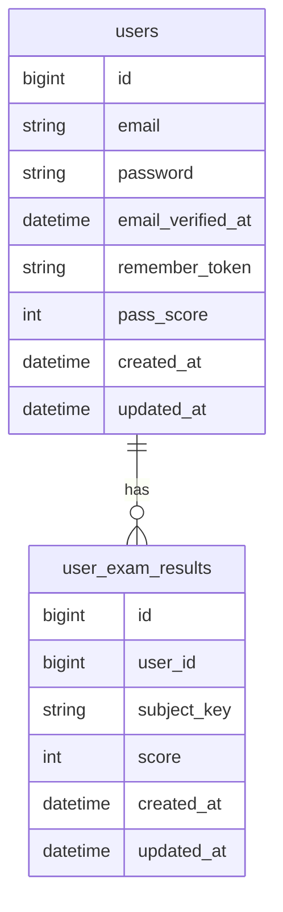

# ERD / DB設計

## ER図

## テーブル定義（表）

### users

| column | type | nullable | default | note |
|---|---|---|---|---|
| id | bigint | no |  | PK |
| email | string | no |  | unique |
| password | string | no |  |  |
| email_verified_at | datetime | yes |  |  |
| remember_token | string | yes |  |  |
| pass_score | int | yes | null | 合格基準点（未入力可） |
| created_at | datetime | no |  |  |
| updated_at | datetime | no |  |  |

### user_exam_results

| column | type | nullable | default | note |
|---|---|---|---|---|
| id | bigint | no |  | PK |
| user_id | bigint | no |  | FK → users.id |
| subject_key | string | no |  | 例: souron, keiri, kiken |
| score | int | no |  | 0–100 |
| created_at | datetime | no |  |  |
| updated_at | datetime | no |  |  |

#### 制約

| constraint | detail |
|---|---|
| unique | (user_id, subject_key) |

## 判定ルール

| rule | detail |
|---|---|
| 合格判定 | pass_score が入力済みのとき score >= users.pass_score |
| 優秀賞 | 8科目すべて合格 かつ 合計点 >= 720 |
